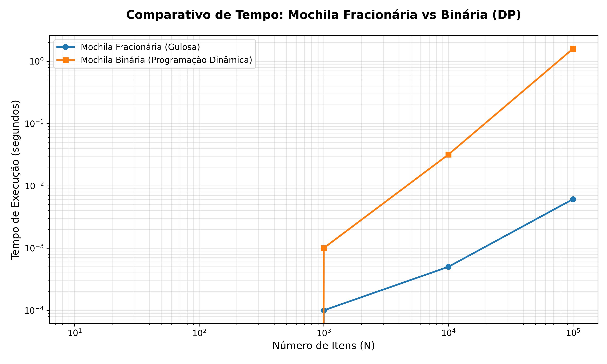
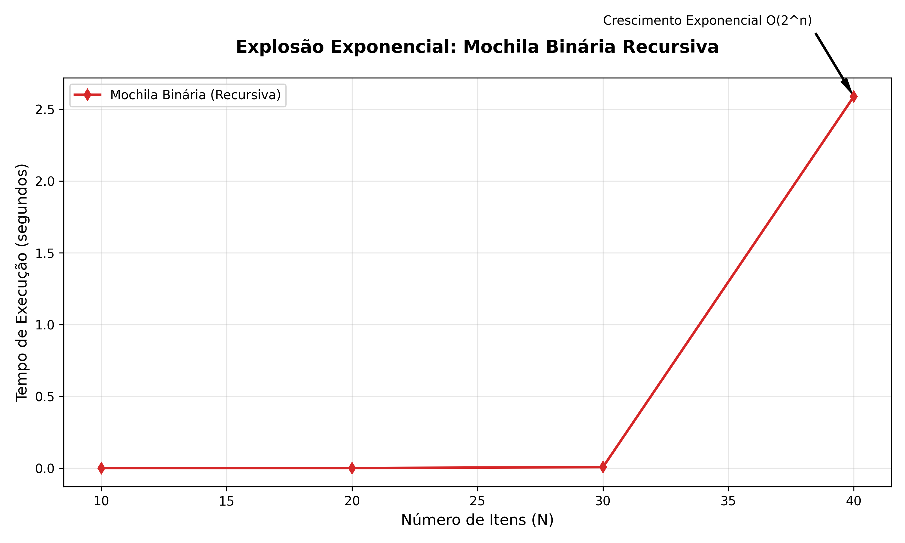
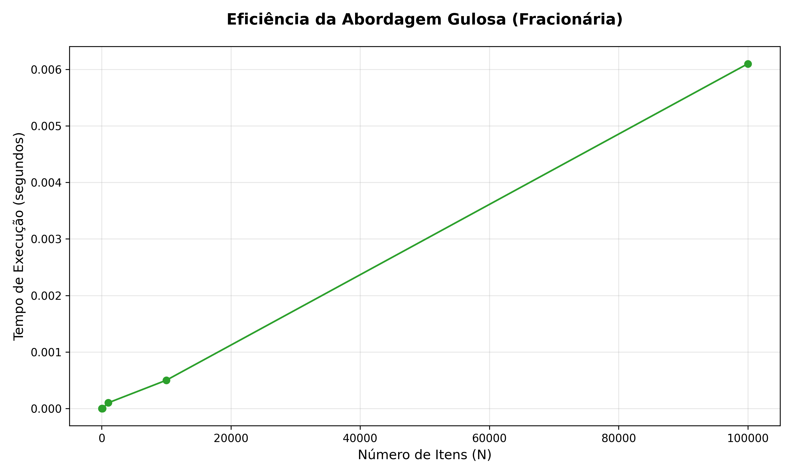

# Relatório de Desempenho: Mochila Fracionária vs Binária

| N (Itens) | Capacidade | Fracionária (Tempo) | Binária Rec. (Tempo) | Binária DP (Tempo) |
| :---: | :---: | :---: | :---: | :---: |
| 10 | 50 | 0.0000s | 0.0000s | 0.0000s |
| 20 | 100 | 0.0000s | 0.0001s | 0.0000s |
| 30 | 150 | 0.0000s | 0.0065s | 0.0000s |
| 40 | 200 | 0.0000s | 2.5894s | 0.0000s |
| 50 | 250 | 0.0000s | 44 min* | 0.0000s |
| 60 | 300 | 0.0000s | 31 dias* | 0.0000s |
| 70 | 350 | 0.0000s | 88 anos* | 0.0000s |
| 80 | 400 | 0.0000s | 90 mil anos* | 0.0000s |
| 90 | 450 | 0.0000s | 92 mi anos* | 0.0000s |
| 100 | 500 | 0.0000s | 94 bi anos* | 0.0000s |
| 1.000 | 2.000 | 0.0001s | - | 0.0010s |
| 10.000 | 10.000 | 0.0005s | - | 0.0317s |
| 100.000 | 50.000 | 0.0061s | - | 1.5853s |
| 1.000.000 | 500.000 | 0.0750s* | - | 160s* |
| 10.000.000 | 5.000.000 | 0.8800s* | - | 4.4h* |

* simboliza valores estimados com base na complexidade assintótica O(n log n) e O(n*W)

## 📊 Gráficos de Desempenho

Os gráficos abaixo foram gerados a partir dos dados coletados na tabela acima:

### 1. Comparativo Geral (Escala Logarítmica)
Este gráfico mostra a diferença de desempenho entre a abordagem gulosa (Fracionária) e a Programação Dinâmica (Binária DP) à medida que N cresce.

### 2. Explosão Exponencial (Recursiva)
Demonstra como o tempo de execução da solução recursiva para a mochila binária cresce de forma impraticável para N > 40.

### 3. Eficiência da Mochila Fracionária
Foco na escala linear da solução gulosa, mostrando sua excelente escalabilidade.

